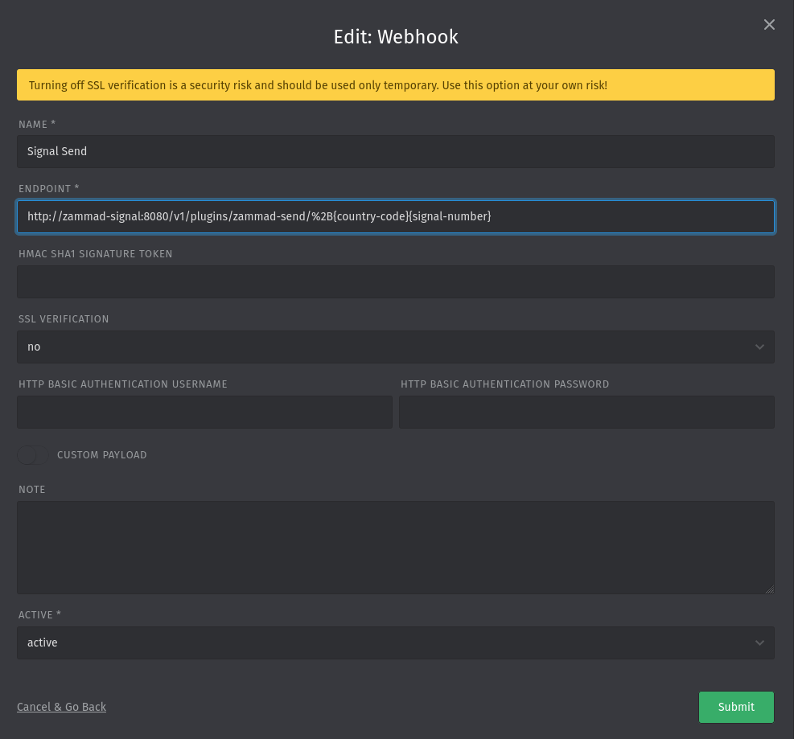
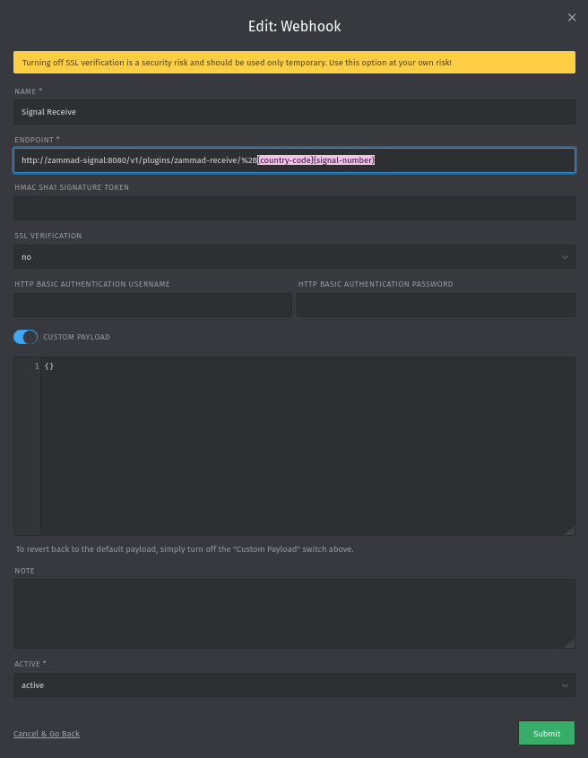
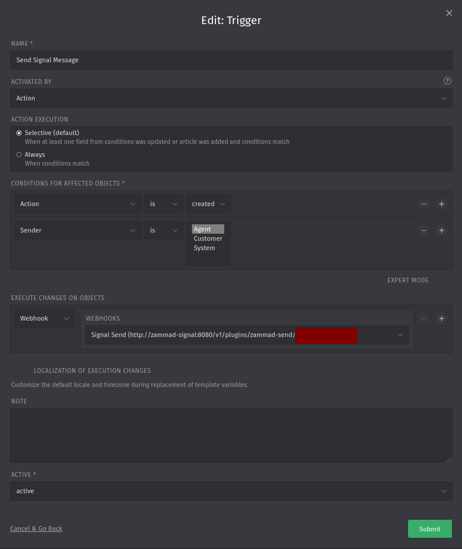

<details>
    <summary>Click to Expand</summary>
# zammad-signal
Container-to-Container Integration

# Usage
## Create an environment file and add these variables
```
ZAMMAD_URL
ZAMMAD_USER
ZAMMAD_PASS
SIGNAL_URL
COUNTRY_CODE
SIGNAL_PHONE_NUMBER
GROUP
```

## Run docker-compose.yml
```
docker compose up -d
```
---
</details>

# Signal API + Webhook Implementation

# Getting Started
### 1. Add the Signal API image and configuration to the Zammad `docker-compose.yml` file

Append the Signal API image and its configurations to the `docker-compose.yml` file.

```
services:
	zammad-signal:
	    image: bbernhard/signal-cli-rest-api:latest
	    ports:
	    	  - "6060:8080"
	    environment:
	      - MODE=active
	      - ENABLE_PLUGINS=true
	    volumes:
	      - $HOME/.local/share/signal-api:/home/.local/share/signal-cli
	      - "./plugins:/plugins"
```

### 2. Connect the Signal API to your Signal account using the QR

Open http://localhost:6060/v1/qrcodelink?device_name=signal-api in your browser, open Signal on your mobile phone, go to Settings > Linked devices and scan the QR code using the + button.


### 3. Add the Zammad variables to the environment of the Signal API image
These environment variables can be added either through the `docker-compose.yml` file or through an environment variable `.env` file.

```
ZAMMAD_AUTH_TOKEN={token}
ZAMMAD_GROUP={group}
```

The authentication token can be generated from the user preferences. In order for API to work properly, ensure that the user and the token have the following permissions enabled:


The permissions for the users can be enabled by creating a `Role` with these permissions and with the proper `Group` (same one used for the environment variable). Then the role should be given to that user.

### 4. Copy the plugins to the `docker-compose.yml` directory
Finally copy the plugins from the repository to the same folder the `docker-compose.yml` is located at.

# Webhook Configuration
### Signal Send
Add a webhook to send message through Signal by going to `Settings` > `Webhook` > `New Webhook` and setting the following configurations:



Be sure to set the correct `country-code` and `signal-number` in the `Endpoint` field.

### Signal Receive
Add a webhook to receive message from Signal and add them to Zammad by going to `Settings` > `Webhook` > `New Webhook` and setting the following configurations:



Be sure to set the correct `country-code` and `signal-number` in the `Endpoint` field.

### Send Message Trigger
In order for Zammad to send a webhook request to Signal when an Agent replies, a Trigger needs to be created by going to `Settings` > `Trigger` > `New Trigger` and setting the following configurations:



The `Action` condition is `Article > Action`.
